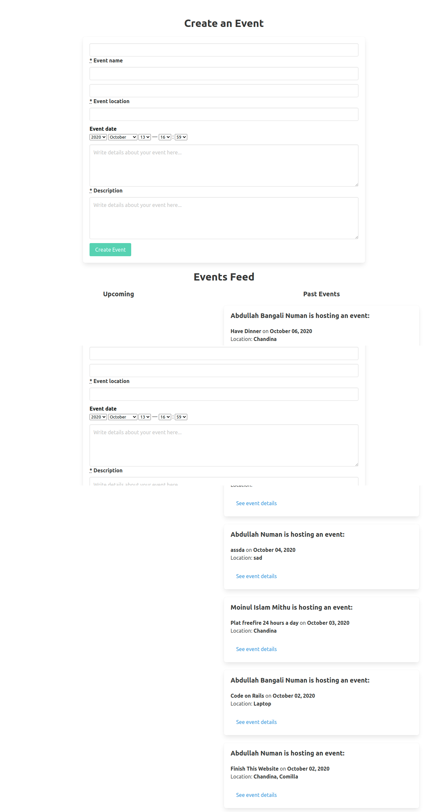
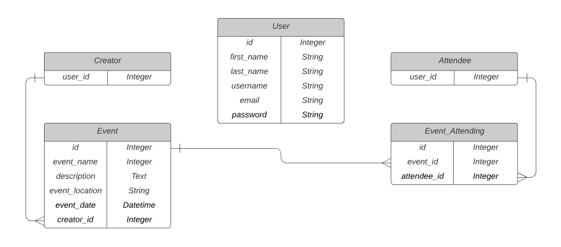

# Private Events - Eventeer

In this project, I created a Rails app for users to create and attend events. It involves has_many through associations. An event has a creator and many attendees. A user can create and attend many events.

I also used validations, complex database queries, as well as RSpec and Capybara for testing.

## App Screenshot

## Built With

* Ruby v 2.7.1
* Rails v 6.0.3.3
* Devise
* Bulma
* Simple Form
* SQLite3
* RSpec
* Capybara
* FactoryBot
* Faker Gem

## Database ERD

## Deployment

1. Open your Terminal and navigate to the directory of your choice
2. Clone this repo from [here](https://github.com/anewman15/private-events)
3. `cd` into the repo folder and run `bundle install`
4. Make sure you have the latest version of `yarn` installed in your machine. Sometimes the presence of `cmdtest` prevents `yarn` from being upgraded to its latest version
5. Run `rails db:migrate`
6. Run `rails server` and navigate to `localhost:3000` in your browser
7. The home page will have a form for creating an event. It will also list all the events created by all the users
8. Sign up, log in and click the `Create Event` button to go back to the home page. Use the form to create some events.
9. Sign up from another browser using a second `username` and `email`. Create some events from that account
10. When an event is successfully created, it takes you to the event page
11. Now, attend the events using the `Attend this event` button. Your name will appear in the event `Attendees` list. Try attending the event you already have attended. It will give you an notice/alert
12. You can navigate to other pages using the `Go To Main Feed` and `Go to My Events` links
13. Visit the home page by clicking the `Go To Main Feed` or `Eventeer` brand link left of the navbar. It will list all the events created. Events are listed as `Upcoming` and `Past Events`
14. Now, click the `My Events` link in the right side of the navbar. It will list all events you have created, as well as those you are attending. Each section is subdivided into `Upcoming` and `Past Events` sections
15. Finally, log out and it will lead you back to home page and you will have to log in in order to create and attend an event

## Author
👤 **Abdullah Numan**

- Github:   https://github.com/anewman15
- Twitter:  https://twitter.com/aanuman15
- Linkedin: https://www.linkedin.com/in/aanuman15/
- Email:    anewman15@hotmail.com

## 🤝 Contributing

Contributions, issues and feature requests are welcome!

Feel free to check the [issues page](https://github.com/anewman15/private-events/issues/).

## Show your support

Give a ⭐️ if you like this project!

## Acknowledgments

- https://www.microverse.org/
- https://www.theodinproject.com/
- https://guides.rubyonrails.org/
- https://www.stackoverflow.com/
